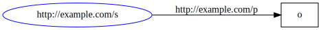

[[Home]] > [[User Guide|UserGuide]] > Dynamic API

# Dynamic API 

## Nodes as dictionaries

### Simple

Nodes in a graph can be thought of as dictionaries (maps, hashes) where keys are predicates of outgoing statements (where given node is subject) and values are collections of objects of those statements.

For example the following graph
```turtle
@prefix : <http://example.com/> .

:s
  :p1
    :o1 ,  # t1
    "o2" , # t2
    [] ;   # t3
  :p2
    :o4 ,  # t4
    "o5" , # t5
    [] .   # t6
```


is eqivalent to this dictionary:
```csharp
var f = new NodeFactory();
var p1 = f.CreateUriNode(new Uri("http://example.com/p1"));
var o1 = f.CreateUriNode(new Uri("http://example.com/o1");
var o2 = f.CreateLiteralNode("o2");
var o3 = f.CreateBlankNode();
var p2 = f.CreateUriNode(new Uri("http://example.com/p2"));
var o4 = f.CreateUriNode(new Uri("http://example.com/o4");
var o5 = f.CreateLiteralNode("o5");
var o6 = f.CreateBlankNode();

var s = new Dictionary<INode, ICollection<INode>>
{
  {
    p1,
    new INode[]
    {
      o1, // t1
      o2, // t2
      o3, // t3
    }
  },
  {
    p2,
    new INode[]
    {
      o4, // t4
      o5, // t5
      o6, // t6
    }
  },
};
```

### Resource node recursion

In the case of resource objects (IRI or blank nodes, not literals), the process can be repeated recursively, i.e. items in the value collection are dictionaries themselves.

For example the following graph
```turtle
@prefix : <http://example.com/> .

:s1
  :p
    :s2 ,  # t1
    _:s3 . # t2

:s2
  :p
    "o1" . # t3

_:s3
  :p
    "o2" . # t4
```


is eqivalent to this dictionary:
```csharp
var f = new NodeFactory();
var p = f.CreateUriNode(new Uri("http://example.com/p"));
var o1 = f.CreateLiteralNode("o1");
var o2 = f.CreateLiteralNode("o2");

var s1 = new Dictionary<INode, ICollection<object>>
{
  {
    p,
    new object[]
    {
      new Dictionary<INode, ICollection<object>> // t1
      {
        p,
        new INode[]
        {
          o1,                                    // t3
        }
      },
      new Dictionary<INode, ICollection<object>> // t2
      {
        p,
        new INode[]
        {
          o2,                                    // t4
        }
      }
    }
  },
};
```

### Literal node translation 

Literal objects on the other hand can be translated to their corresponding primitive types.

For example the following graph
```turtle
@prefix : <http://example.com/> .
@prefix xsd: <http://www.w3.org/2001/XMLSchema#> .

:s
  :p
    "o" ,                                              # t1
    true ,                                             # t2
    9223372036854775807 ,                              # t3
    1.79769313486232E+308 ,                            # t4
    "255"^^xsd:unsignedByte ,                          # t5
    "9999-12-31T23:59:59.999999+00:00"^^xsd:dateTime , # t6
    "79228162514264337593543950335"^^xsd:decimal ,     # t7
    "3.402823E+38"^^xsd:float ,                        # t8
    "P10675199DT2H48M5.4775807S"^^xsd:duration .       # t9
```


is eqivalent to this dictionary:
```csharp
var f = new NodeFactory();
var p = f.CreateUriNode(new Uri("http://example.com/p"));

var s = new Dictionary<INode, ICollection<object>>
{
  {
    p,
    new object[]
    {
      "o",                     // t1
      true,                    // t2
      long.MaxValue,           // t3
      double.MaxValue,         // t4
      byte.MaxValue,           // t5
      DateTimeOffset.MaxValue, // t6
      decimal.MaxValue,        // t7
      float.MaxValue,          // t8
      TimeSpan.MaxValue        // t9
    }
  },
};
```

### Dictionary key conversions

When looking at nodes as dictionaries, keys represent statement predicates, and so they are ultimately Uri nodes.

```csharp
var key = f.CreateUriNode(new Uri("http://example.com/p"));
```

But it's safe to assume that plain Uris used as node dictionary keys also correspond to statement predicates, so they can be automatically converted to Uri nodes.

```csharp
var key = new Uri("http://example.com/p");
```

Furthermore, plain strings used as node dictionary keys can be safely assumed to be Uri strings of statement predicate nodes, so they can also be automatically converted.

```csharp
var key = "http://example.com/p";
```

Assuming a base Uri, relative Uris can also be used as node dictionary indices.

```csharp
// assuming @base <http://example.com/>
var key = new Uri("p", UriKind.Relative);
```

Again assuming a base Uri, node dictionary key strings that are not absolute Uris can be interpreted as relative Uris of predicate nodes.

```csharp
// assuming @base <http://example.com/>
var key = "p";
```

Finally, string keys that look like QNames can be expanded against a graph's namespace manager.

```csharp
// assuming @prefix ex: <http://example.com/>
var key = "ex:p";
```

The QName notation also works for the default (empty) prefix.

```csharp
// assuming @prefix : <http://example.com/>
var key = ":p";
```

To summarise, the following graph

```turtle
@prefix : <http://example.com/> .
@prefix ex: <http://example.com/> .
@base <http://example.com/> .

<s> <p> "o" .
```



is equivalent to all of these dictionaries:

```csharp
var objects = new [] { "o" };

// Uri node
var s = new Dictionary<INode, ICollection<object> { {
  f.CreateUriNode(new Uri("http://example.com/p")),
  objects } };

// Absolute Uri
var s = new Dictionary<Uri, ICollection<object> { {
  new Uri("http://example.com/p"),
  objects } };

// Relative Uri
var s = new Dictionary<Uri, ICollection<object> { {
  new Uri("p", UriKind.Relative), 
  objects } };

// Absolute Uri string
var s = new Dictionary<string, ICollection<object> { {
  "http://example.com/p", 
  objects } };

// Relative Uri string
var s = new Dictionary<string, ICollection<object> { {
  "p", 
  objects } };

// QName
var s = new Dictionary<string, ICollection<object> { {
  "ex:p", 
  objects } };

// QName with default (empty) prefix
var s = new Dictionary<string, ICollection<object> { {
  ":p", 
  objects } };
``